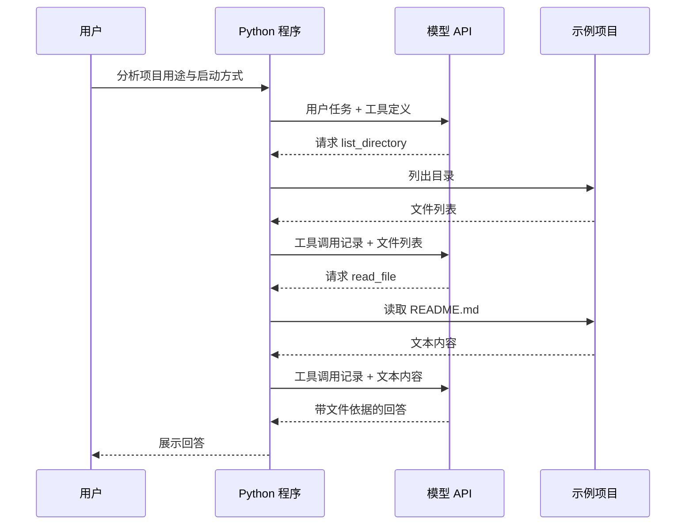

# 01 从读懂到动手：用 Python 构建一个能读懂项目的 Agent

hi，我是渔夫。

上一篇，我们聊了 DeepSeek Harness 如何通过 Cordis，把模型、工具、会话和权限组合起来。

今天开始动手，用 Python 构建一个 **Agent Harness 应用**。项目叫 **AgentHarnessLab**，使用 uv 管理环境与依赖，文章、代码和笔记全部免费开放。

第一步，给它一个项目目录，让它调用工具查看文件，回答三个问题：**项目做什么、代码在哪里、如何运行。**

## 一、模型怎样读取本地文件

假设你在终端里输入：

> 分析这个项目的用途、目录结构和启动方式，并说明你的判断依据。

如果程序只是把这句话发给模型，模型其实没有看到你的本地文件。即使你在问题里写上一个磁盘路径，这个路径也只是消息中的一段文字。

要让它分析真实项目，我们需要提供两种能力：

| 工具 | 能做什么 | 示例参数 |
| --- | --- | --- |
| `list_directory` | 列出指定目录的直接子项 | `{"path": "."}` |
| `read_file` | 读取一个 UTF-8 文本文件 | `{"path": "README.md"}` |

模型先根据任务提出工具调用，Python 程序执行工具，再把结果交回模型。模型得到新信息后，决定继续查看文件，还是给出回答。



这里有一个关键分工：**模型决定请求什么，程序决定允许执行什么，并负责实际执行。** DeepSeek 官方的 [Tool Calls 文档](https://api-docs.deepseek.com/zh-cn/guides/tool_calls/) 也明确说明，具体函数需要由应用提供，模型不会直接执行这些函数。

模型、工具、消息历史和执行循环，构成了本篇的最小实现。

## 二、从零创建 AgentHarnessLab

先安装 [uv](https://docs.astral.sh/uv/getting-started/installation/)，在终端执行 `uv --version` 确认安装成功。选择一个存放代码的位置，创建自己的项目：

```bash
uv init --lib --name agent-harness-lab --python 3.12 AgentHarnessLab
cd AgentHarnessLab
uv add openai
```

第一条命令创建 `AgentHarnessLab` 目录，并生成带 `src` 布局的 Python 包。`--name agent-harness-lab` 指定包名，对应的 Python 导入名是 `agent_harness_lab`；`--python 3.12` 指定起步使用的 Python 版本。这里使用 `--lib` 生成包结构，命令行入口由后面的代码提供。

`uv add openai` 安装模型客户端 SDK，记录依赖并生成 `uv.lock`。后续章节都在这个项目里继续开发，共用根目录的 `pyproject.toml`、`uv.lock` 和 `.venv`。

这里的 `openai` 是 SDK 包名，我们通过 `base_url` 将请求发给 DeepSeek。官方 [首次调用 API](https://api-docs.deepseek.com/zh-cn/) 文档展示了这种接入方式。

用编辑器打开 `AgentHarnessLab`。将自动生成的 `src/agent_harness_lab/__init__.py` 内容替换为：

```python
"""Agent Harness Lab：从工具调用开始构建 Agent Harness 应用。"""
```

接着创建 `src/agent_harness_lab/first_agent.py`，用于实现本篇的工具与执行循环。再创建 `examples/01-project-reader/sample-project/`，用于存放 Agent 要读取的示例文件。

完成本篇后的相关文件如下，`check_tools.py` 用于第七节的工具检查：

```text
AgentHarnessLab/
├── pyproject.toml              # uv 生成：项目与依赖配置
├── uv.lock                     # uv 生成：依赖锁文件
├── src/
│   └── agent_harness_lab/
│       ├── __init__.py
│       └── first_agent.py      # 工具与执行循环
└── examples/
    └── 01-project-reader/
        ├── check_tools.py     # 本地工具检查
        └── sample-project/
            ├── README.md
            └── app.py
```

**下面所有命令都在 `AgentHarnessLab` 根目录执行。** `src/` 保存持续完善的应用代码，`examples/` 保存各篇的示例与检查脚本，不需要每篇重新初始化项目。正文只讲核心片段，不需要将片段逐段拼接。完整文件可从文末 GitHub 链接获取，放到上面的对应路径后运行；也可以先自己实现，再对照源码检查。

`examples/01-project-reader/sample-project/README.md` 写入：

````markdown
# Greeting Demo

这是一个输出问候语的 Python 命令行示例。

代码入口为 app.py，只使用 Python 标准库。

从项目目录运行：

```bash
python app.py
```
````

`examples/01-project-reader/sample-project/app.py` 写入：

```python
print("Hello from Greeting Demo!")
```

用这两个文件核对助手的回答。工具读取的文本会发送给模型服务，练习目录中不要放凭据或私有资料。

## 三、把工具写出来：路径、参数和结果

工具包含两部分：给模型看的参数说明，以及本地真正执行的函数。下面只展示关键代码，完整实现见文末源码链接。

以 `read_file` 为例，模型收到的工具定义如下：

```python
{
    "type": "function",
    "function": {
        "name": "read_file",
        "description": "读取工作目录内的小型 UTF-8 文本文件",
        "parameters": {
            "type": "object",
            "properties": {"path": {"type": "string"}},
            "required": ["path"],
            "additionalProperties": False,
        },
    },
}
```

本地执行前，先校验参数，再解析路径：

```python
params = json.loads(arguments)
if not isinstance(params, dict) or set(params) != {"path"}:
    raise ValueError("参数必须是仅包含 path 的 JSON 对象")
raw_path = params["path"]
if not isinstance(raw_path, str) or not raw_path.strip():
    raise ValueError("path 必须是非空字符串")
target = resolve_path(workspace, raw_path)
```

`resolve_path` 将读取范围限定到工作目录：

```python
def resolve_path(workspace: Path, raw_path: str) -> Path:
    relative = Path(raw_path)
    if relative.is_absolute():
        raise ValueError("只接受工作目录内的相对路径")
    target = (workspace / relative).resolve()
    if not target.is_relative_to(workspace):
        raise ValueError("路径超出了允许的工作目录")
    return target
```

确认目标是普通文件后，限制读取大小并返回文本：

```python
if not target.is_file():
    raise ValueError("目标不是普通文件，或文件不存在")
with target.open("rb") as handle:
    raw = handle.read(max_bytes + 1)
if len(raw) > max_bytes:
    raise ValueError("文件超过读取上限，本次未返回正文")
data = {"text": raw.decode("utf-8")}
```

这些定义组成 `TOOLS` 列表，是给模型看的工具说明，告诉模型有哪些函数、分别做什么、参数应该怎么写。真正接触本地文件的是 `execute_tool`，工具说明本身没有执行能力。

接着看 `arguments`。模型发来的参数是 JSON 字符串，我们需要解析它，确认只有一个非空字符串字段 `path`。即使 Schema 已经写了参数要求，本地仍然需要校验，因为这些值来自模型 API。

再看路径处理。我们先把工作目录和模型给出的相对路径组合起来，通过 `resolve()` 处理 `..` 和符号链接，再判断目标是否仍在工作目录内。例如 `../outside.txt` 应被拒绝，不能只依赖提示词让模型“不要越界”。

路径检查适用于本地、静态的练习目录。检查后文件仍可能被其他进程替换，因此它不能代替沙箱隔离。

文件读取最多尝试读取上限加一个字节，目录枚举也有条目上限。超出时返回明确错误，避免把截断内容伪装成完整文件。

工具结果统一返回 JSON 字符串：成功包含 `ok: true` 和正文，失败包含 `ok: false` 和错误说明，供模型决定下一步。

## 四、把工具结果交回去：执行循环的核心

执行循环处理两种结果：模型请求工具时执行工具并继续；模型正常给出最终回答时结束。

先带上消息历史和工具定义请求模型：

```python
response = client.chat.completions.create(
    model=args.model,
    messages=messages,
    tools=TOOLS,
    stream=False,
    max_tokens=2048,
    extra_body={"thinking": {"type": "disabled"}},
)
choice = response.choices[0]
message = choice.message
calls = message.tool_calls or []
```

收到完整、合法的工具调用后，先将模型的调用消息保存到 `messages`，再逐个执行工具，回传结果：

```python
result = execute_tool(
    workspace,
    call.function.name,
    call.function.arguments,
    args.max_bytes,
    args.max_entries,
)
messages.append(
    {
        "role": "tool",
        "tool_call_id": call.id,
        "content": result,
    }
)
```

所有工具结果追加完成后进入下一轮请求。没有工具调用时，检查模型是否正常结束：

```python
if choice.finish_reason != "stop" or not message.content:
    raise RuntimeError("模型没有正常完成回答，请检查输出上限或响应状态")
return message.content
```

完整实现还检查空响应、工具调用类型、单轮工具数量与最大轮数，避免响应不完整时执行工具，或任务无限继续。

理解这个过程，重点看下面四处。

### 1. 每次请求都带上本次任务的消息历史

最开始，历史里只有系统说明和用户任务。工具执行后，历史里增加模型的工具调用记录及对应结果，下一次模型请求才能使用这些新信息。

这里的“模型看到文件”，准确地说，就是模型收到了工具返回的文件文本。本篇把历史保存在内存里，退出进程就丢失；这还不是持久化会话。

### 2. 先记录调用，再记录结果

一次模型响应可能包含多个工具调用，所以代码遍历整个 `calls`。每个结果都带有原调用的 `tool_call_id`，使模型服务可以把结果对应回具体请求。这也是官方 [Tool Calls 示例](https://api-docs.deepseek.com/zh-cn/guides/tool_calls/) 所展示的消息交互方式。

如果只把文件内容当成普通用户消息追加，调用与结果的对应关系就丢失了。

### 3. 有工具调用，就执行后继续；正常回答，才结束

`continue` 会开始下一轮模型请求。模型可以先列目录，再读 README，也可以在一轮里请求读取两个文件。我们没有把“第二步必须读哪个文件”硬编码进循环。

但“不再调用工具”也不能直接等同于成功。输出达到长度上限等情况可能导致响应提前结束，所以代码检查 `finish_reason`。达到最大轮数时，我们报告任务未完成，不输出一个假的成功结果。

即使正常收到最终回答，也只是说明这一轮对话完成了。答案是否符合用户要求，还需要后面的验收。

### 4. 先让过程完整可见

本篇关闭流式输出和思考模式，完整接收响应后再执行工具。参数说明见 DeepSeek [思考模式文档](https://api-docs.deepseek.com/zh-cn/guides/thinking_mode/)。

终端进度写入标准错误输出，最终回答写入标准输出。这样可以把答案重定向到文件，同时在终端继续观察执行进度。下一篇再处理流式响应和 Provider 封装。

## 五、补上命令行入口

入口使用 `argparse` 接收任务、工作目录和执行限制。参数解析代码放在完整源码中，正文重点看客户端配置：

```python
with OpenAI(
    api_key=api_key,
    base_url="https://api.deepseek.com",
    timeout=args.timeout,
    max_retries=0,
) as client:
    print(run_agent(client, workspace, args))
```

| 参数 | 默认值 | 作用 |
| --- | --- | --- |
| `--workspace` | 必填 | 允许读取的目录 |
| `--model` | 环境变量 `DEEPSEEK_MODEL` | 本次使用的模型 |
| `--max-rounds` | 8 | 最大模型请求轮数 |
| `--max-calls-per-round` | 4 | 每轮最多执行的工具数 |
| `--max-bytes` | 16000 | 单个文件读取上限 |
| `--max-entries` | 100 | 单个目录条目上限 |
| `--timeout` | 60 秒 | SDK 请求超时配置 |

这些参数是初始实验值，可以按命令行调整，不代表适用于所有任务。`max_rounds` 限制模型请求次数，`max_calls_per_round` 限制单轮工具数量，二者共同限制工具调用总数；`max_bytes` 和 `max_entries` 限制单次读取规模。

客户端关闭自动重试，让第一次学习时的请求次数更容易理解。`timeout` 是 SDK 请求超时配置，不是整项任务的严格墙钟截止时间；重试、全局时间预算和取消传播后续再展开。按 Ctrl+C 会停止本地脚本，但不能据此承诺模型服务端计算立即结束或不再计费。

## 六、配置凭据，运行第一次分析

将完整源码放到前面的对应路径后，先验证模块可以启动，这一步不会调用模型：

```bash
uv run python -m agent_harness_lab.first_agent --help
```

接着配置自己的 DeepSeek API Key，真实调用按服务商规则计费。下面的命令会提示输入密钥且不回显，按终端选择一组即可。

macOS、Linux 的 bash / zsh：

```bash
export DEEPSEEK_API_KEY="$(uv run python -c 'import getpass; print(getpass.getpass("DeepSeek API Key: "))')"
export DEEPSEEK_MODEL="deepseek-v4-pro"
```

Windows PowerShell：

```powershell
$env:DEEPSEEK_API_KEY = uv run python -c 'import getpass; print(getpass.getpass("DeepSeek API Key: "))'
$env:DEEPSEEK_MODEL = "deepseek-v4-pro"
```

模型名按账号可用模型填写，参考官方 [模型说明](https://api-docs.deepseek.com/zh-cn/quick_start/pricing)。脚本读取环境变量，不会自动加载 `.env`。

随后执行：

```bash
uv run python -m agent_harness_lab.first_agent --workspace ./examples/01-project-reader/sample-project "分析这个项目的用途、目录结构和启动方式，并说明你的判断依据"
```

执行过程示意如下，实际调用顺序与回答措辞可能不同：

```text
[模型请求 1/8]
[工具] list_directory
[模型请求 2/8]
[工具] read_file
[工具] read_file
[模型请求 3/8]

这个项目是一个输出问候语的 Python 命令行示例。
依据：README.md 描述了用途，app.py 包含输出语句。

主要文件：README.md 是项目说明，app.py 是程序入口。

README.md 给出的启动方式：在项目目录执行 python app.py。
本次只读取了文件，没有实际执行程序。
```

读取到启动说明不等于验证启动成功。本篇没有命令执行工具，回答应明确这一点。

在命令后加 `> report.md`，可将最终回答保存到项目根目录。

## 七、怎样证明它真的使用了文件

修改输入，检查回答是否随文件内容变化。

### 实验一：修改文档中的项目名称

把 `examples/01-project-reader/sample-project/README.md` 中的项目名称改成一个自己临时编的名称，例如“蓝鲸问候实验 42”，然后重新运行分析命令。

检查回答是否引用新名称，并指出依据是 README。如果代码和文档的说法不一致，合理回答应该指出差异，而不是自行选一个事实。修改只发生在本地，模型需要重新读取文件才能获得新内容。

### 实验二：移除启动说明

删除 README 中的启动命令，再重新分析。助手可以根据 `app.py` 推测运行方式，但必须把推测和文档中明确给出的事实区分开。

验收时关注依据是否准确、推测是否标明。

### 实验三：不用模型，直接验证工具限制

配套的 `check_tools.py` 直接调用工具函数，检查正常读取、文件不存在、越界路径、非法参数和读取上限。以拒绝越界路径为例：

```python
result = json.loads(execute_tool(root, "read_file", '{"path":"../outside.txt"}', 100, 10))
assert result["ok"] is False
```

完整检查脚本会创建临时目录和测试文件，无需模型参与。

执行：

```bash
uv run python examples/01-project-reader/check_tools.py
```

这段检查不会发模型请求，也无需 API Key。它验证的是文件读取、越界路径、非法参数和读取上限等确定性行为。

前两个实验检查模型如何使用资料；这个脚本检查工具本身是否按约束执行。

## 八、遇到问题时，先定位到哪一步

| 现象 | 优先检查 |
| --- | --- |
| 提示缺少 API Key | 环境变量是否设置在执行脚本的同一个终端；本篇不会读取 `.env`。 |
| 提示无法导入 openai | 是否在 `AgentHarnessLab` 根目录执行了 `uv add openai`，运行时是否使用 `uv run`。 |
| API 返回认证或余额错误 | 在服务商控制台检查凭据、账号状态和可用额度，不要反复重试。 |
| API 提示模型或参数不可用 | 核对当前模型名称，以及该模型对工具调用和思考模式选项的支持。 |
| 工具返回路径错误 | 参数是否相对 `--workspace` 指定的示例目录；读取 README 应传 `README.md`，而不是重复带上 `sample-project/`。 |
| 回答没有依据 | 检查是否发生读取调用，任务要求是否明确，以及工具是否实际返回了错误。 |
| 提示轮数耗尽 | 先观察工具是否反复报错、目标是否过大；缩小问题后再决定是否增加轮数。 |

排查顺序是：命令能否启动 → 工具能否读取 → 模型能否使用结果。

## 九、动手练习

给示例项目添加 `config.json`，让助手解释某个配置项，并同时引用 README 和配置文件作为依据。先使用现有两个工具完成任务，记录它读取了什么、回答是否有依据，以及失败时工具返回了什么。

再回到代码里，找到三个位置：模型发出工具调用、本地执行函数、工具结果加入消息历史。把这三处串起来，就是本篇实现的 Agent 执行循环。

下一篇继续拆解模型接入，处理流式文本和工具参数拼接。

## 完整代码

- [工具与执行循环：first_agent.py](https://github.com/anxiong2025/AgentHarnessLab/blob/main/src/agent_harness_lab/first_agent.py)
- [示例文件与工具检查](https://github.com/anxiong2025/AgentHarnessLab/tree/main/examples/01-project-reader)
- [课程目录](https://github.com/anxiong2025/AgentHarnessLab/tree/main/docs/articles)

从零搭建的读者按第二节创建项目，将以上文件放到对应路径即可。直接使用参考项目的读者，在项目根目录执行 `uv sync --locked` 后运行本文命令。
